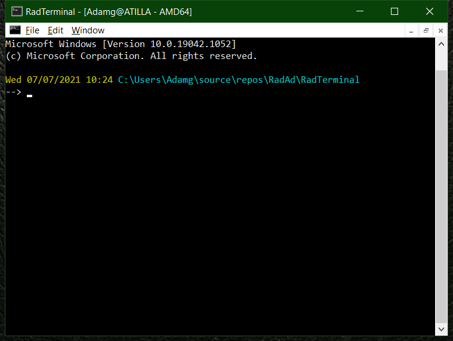

<!--  RadTerminal -->
 [RadTerminal](../..)
==========

Simple Terminal Emulator for Windows using [libtsm](https://github.com/RadAd/libtsm). Implemented using a [Pseudo Console](https://docs.microsoft.com/en-us/windows/console/pseudoconsoles).


[](../../releases/latest)
[](https://ci.appveyor.com/project/RadAd/RadTerminal)
[](LICENSE.txt)



Dependencies
=======
[libtsm](https://github.com/RadAd/libtsm) - Terminal-emulator State Machine

Build
=======
```bat
msbuild RadTerminal.vcxproj -p:Configuration=Release -p:Platform=x64
```

Execute
=======
```bat
msbuild RadTerminal.vcxproj -p:Configuration=Release -p:Platform=x64 /t:Build,Run
```

License
=======
[MIT License](LICENSE.txt)
